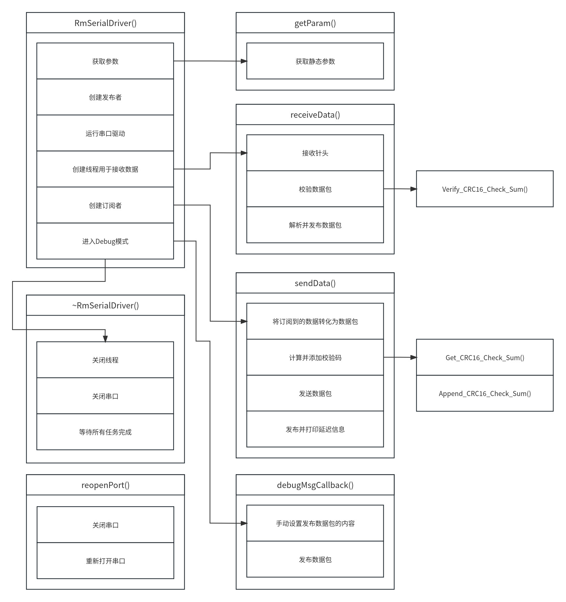

# rm_serial_driver

## Overview

RoboMaster 串口通信驱动模块

## Dependencies

- [serial_driver](https://github.com/ZhaoXiangBox/serial)

    串口通信库

## Packages

- [rm_serial_driver](rm_serial_driver)

    订阅串口数据并解析，发布机器人状态

## RmSerialDriver
串口通信驱动类，订阅串口数据并解析，发布机器人状态

### 模块

- `RmSerialDriver`

    构造函数
    - 获取参数
    - 创建发布者
    - 运行串口驱动
    - 创建线程用于接收数据，回调函数为 `receiveData`
    - 创建订阅者，回调函数为 `sendData`
    - Debug

- `~RmSerialDriver`
    
    析构函数
    - 关闭线程
    - 关闭串口
    - 等待所有任务完成

- `receiveData`

    数据接收函数，在`RmSerialDriver`中调用，是线程`receive_thread_`的回调函数
    - 当串口打开时，循环接收数据
    - 接收针头为`0x5A`的数据包
    - 校验数据包，此处调用`crc.hpp`中的`Verify_Crc16_Check_Sum`函数
    - 解析并发布数据包

- `sendData`

    数据发送函数，在`RmSerialDriver`中调用，是订阅者`target_sub_`的回调函数
    - 将订阅到的数据转化为数据包
    - 调用`crc.hpp`中的`Append_CRC16_Check_Sum`函数，计算并添加校验码
    - 发送数据包
    - 发布并打印延迟信息

- `getParam`

    获取参数函数，在`RmSerialDriver`中调用
    - 获取静态参数

- `reopenPort`

    重新打开串口函数，在`receiveData`、`sendData`、`reopenPort`、`debugMsgCallback`中，当识别到串口启动失败时调用
    - 关闭串口
    - 重新打开串口

- `debugMsgCallback`

    用于Debug的函数，发布一个自定义的数据包，用于测试通信，在`RmSerialDriver`中调用，是定时器`debug_mTimer_`的回调函数
    - 手动设置发布数据包的内容
    - 发布数据包

### 包含的头文件：

- [rm_serial_driver.hpp](rm_serial_driver/rm_serial_driver.hpp)

    RmSerialDriver 类的声明

- [packet.hpp](rm_serial_driver/rm_packet.hpp)

    定义了数据包的格式

- [crc.hpp](rm_serial_driver/crc.hpp)

    用于 CRC 校验

### 订阅的话题

- `/tracker/target`

    用于接收目标装甲板信息，回调函数为 `sendData`

### 发布的话题：

- `/color`

    用于发布敌方机器人颜色

- `/bullet_speed`

    用于发布子弹速度

- `/joint_states`

    用于发布机器人云台状态

- `/latency`

    用于发布延迟

### 静态参数：

- `timestamp_offset`

    时间戳偏移量，用于校准时间

- `debug_mode`

    是否开启调试模式

- `device_name`

    串口设备名

- `baud_rate`

    波特率

- `flow_control`

    流控制

- `parity`
    
    校验位

- `stop_bits`
    
    停止位

## Header

### Crc

- `W_CRC_TABLE`

    CRC16查找表，用于加速CRC计算过程。此表用于根据数据和当前CRC值快速查找下一个CRC值。

- `Get_CRC16_Check_Sum`

    此函数根据提供的数据计算CRC16校验和。

- `Verify_CRC16_Check_Sum`
    
    此函数验证数据流的最后两个字节是否包含正确的CRC16值。

- `Append_CRC16_Check_Sum`

    此函数计算数据的CRC16值并将其追加到数据流的末尾。

### Packet

- `ReceivePacket`

    该结构体为接收数据包的定义

- `SendPacket`
    
    该结构体为发送数据包的定义

- `fromVector`

    将向量转化为`ReceivePacket`数据包

- `toVector`

    将`SendPacket`数据包转化为向量

### RmSerialDriver

- `RmSerialDriver`

    定义串口通信驱动类

## Graph

